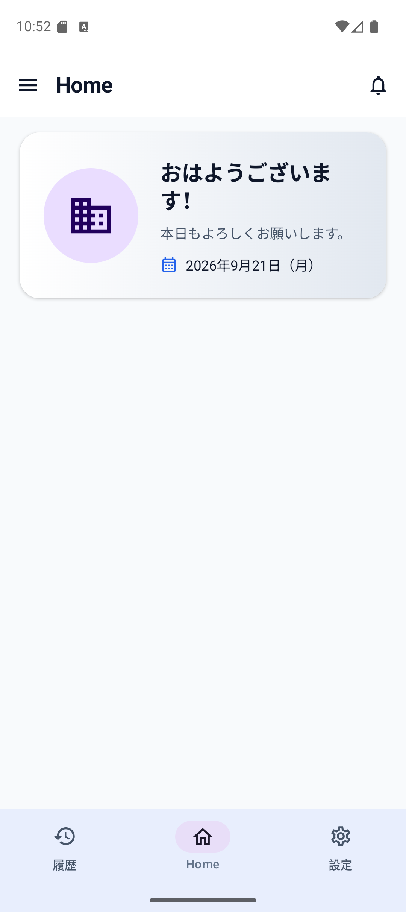
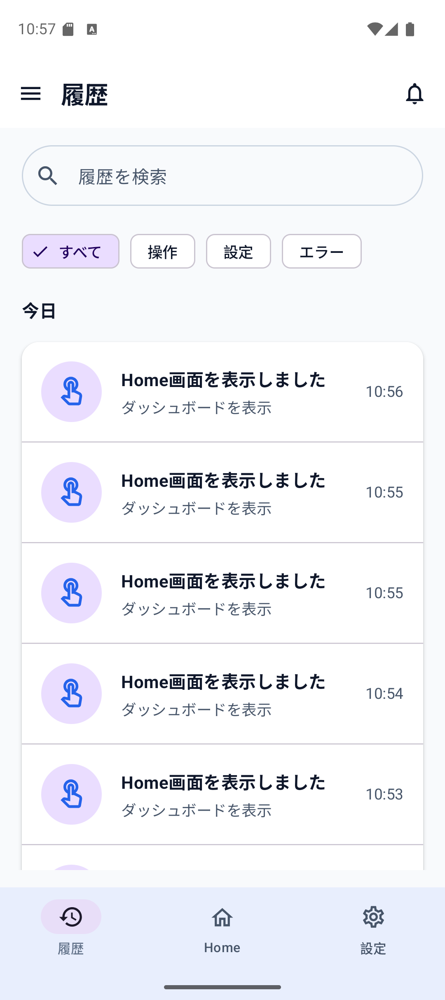
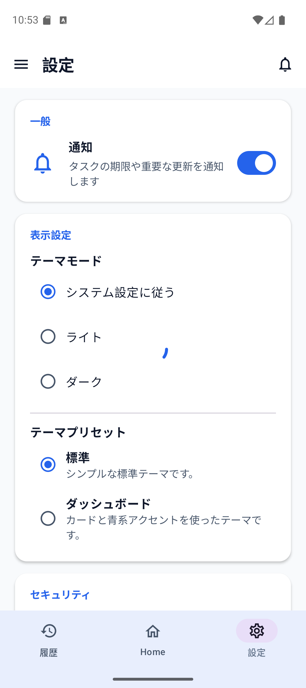
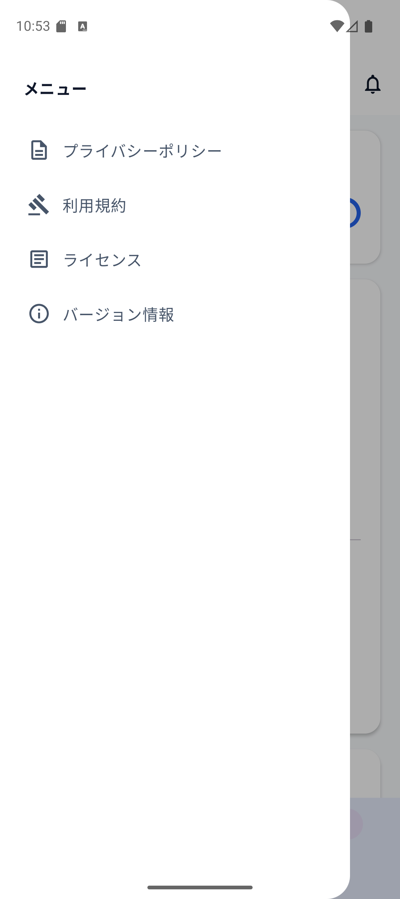
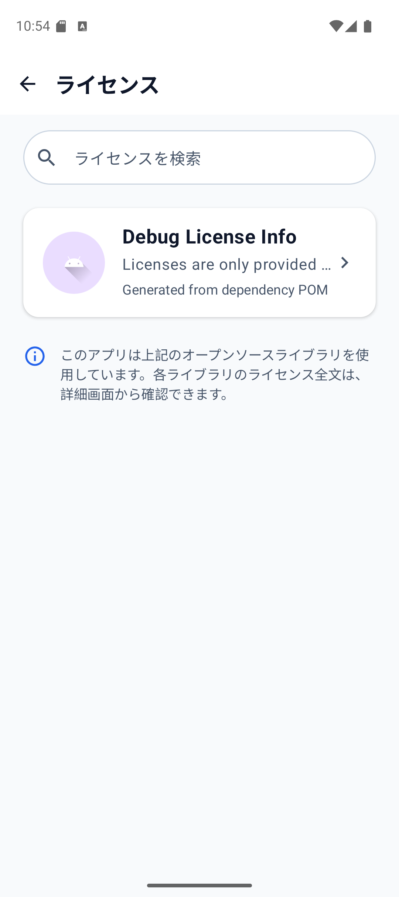
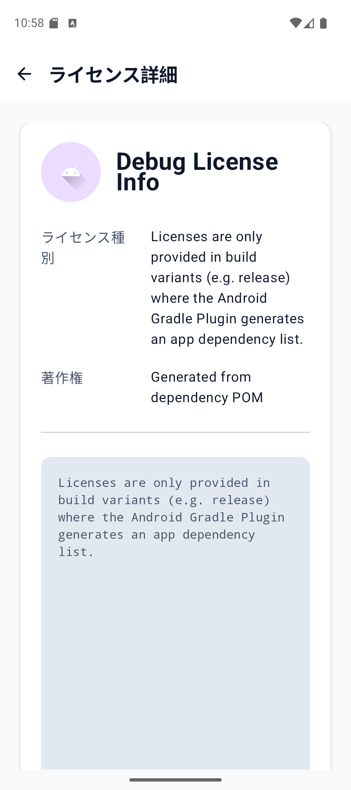
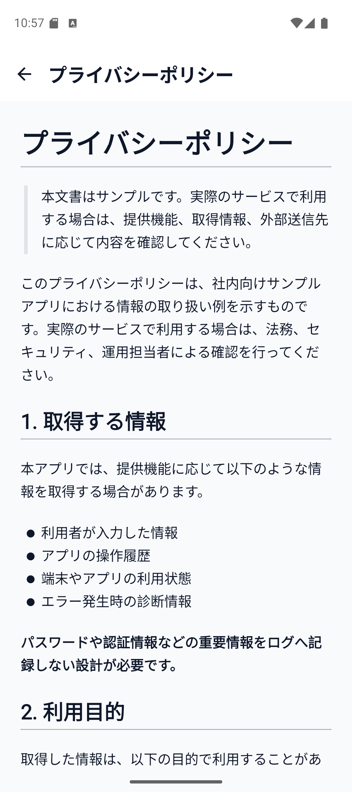
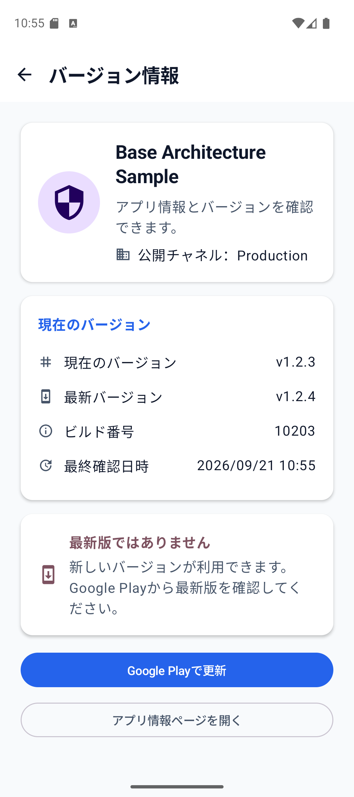

# BaseArchitecture 画面レイアウト設計書

## 1. 目的

本書は、現行ソースのCompose画面を再現するために、画面構造、表示状態、操作部品、遷移先を定義する。

画像だけでは状態遷移や操作条件を表現できないため、画面仕様を本文で定義し、キャプチャは視覚的な基準として併用する。

## 2. 共通レイアウト

| 領域 | 仕様 |
|---|---|
| Root | `BaseAppTheme` 配下のCompose UI |
| Navigation | `AppNavHost` がFeature Graphを登録 |
| Main Navigation | SampleのBottom Navigation。履歴、Home、設定の3項目 |
| Drawer | Sample共通Navigation Drawer。法務文書、License、Version Infoを表示 |
| State購読 | Routeが `collectAsStateWithLifecycle` を利用 |
| Event通知 | Screenは `onEvent` のみを受け取り、ViewModelを参照しない |
| Effect処理 | RouteがDialog、Snackbar、Navigation、外部URIを処理 |
| Theme | `AppViewModel` のTheme設定を `AppRoot` が購読し、全画面へ適用 |

## 3. 画面一覧

| 画面 | Route | 通常 | Loading | Empty | Error | 主な副作用 |
|---|---|---:|---:|---:|---:|---|
| Home | `sample` | ○ | ○ | - | ○ | Dialog、Bottom Navigation |
| History | `sample/history` | ○ | ○ | ○ | ○ | Dialog、Bottom Navigation |
| Settings | `sample/settings` | ○ | ○ | - | ○ | Snackbar、Dialog、Bottom Navigation |
| Legal | `legal/{type}` | ○ | ○ | - | ○ | Dialog、Back |
| License List | `licenses` | ○ | ○ | ○ | ○ | Dialog、Detail遷移、Back |
| License Detail | `licenses/{licenseId}` | ○ | ○ | - | ○ | Dialog、Back |
| Version Info | `version-info` | ○ | ○ | - | ○ | Dialog、外部URI、Back |

## 4. Home

### 4.1 構造

```text
SampleHomeRoute
  -> Scaffold / 共通Navigation
      -> Home content
          -> Header card
              -> greetingMessage
              -> dateText
```

Home本文は現行Sampleでは挨拶・日付のヘッダー表示を中心とする。時間帯判定はDomain Policy、現在時刻取得はCore Provider、表示文言と日付書式はPresentation Formatterが担当する。

### 4.2 状態別表示

| 状態 | 表示 |
|---|---|
| 初期 | 初期State。RouteがInitializeを通知 |
| Loading | Loading表示を可能とする |
| 成功 | 挨拶文言、補足文言、日付を表示 |
| 失敗 | 画面内エラーとDialog Effect |

## 5. History

### 5.1 構造

```text
SampleHistoryRoute
  -> Scaffold / 共通Navigation
      -> title
      -> search field
      -> filter chips
      -> grouped history list
          -> date group title
          -> history item
      -> empty / error area
```

### 5.2 操作

| 部品 | Event | 挙動 |
|---|---|---|
| 検索欄 | `SearchQueryChanged` | titleまたはsummaryの部分一致で絞り込み |
| Filter「すべて」 | `FilterSelected(All)` | 全件表示 |
| Filter「操作」 | `FilterSelected(Action)` | Actionのみ表示 |
| Filter「設定」 | `FilterSelected(Setting)` | Settingのみ表示 |
| Filter「エラー」 | `FilterSelected(Error)` | Error種別またはFailure結果を表示 |
| Home | `HomeClicked` | Homeへ遷移 |
| 設定 | `SettingsClicked` | Settingsへ遷移 |

## 6. Settings

### 6.1 構造

```text
SampleSettingsRoute
  -> Scaffold / 共通Navigation
      -> section: 一般
          -> 通知 Switch
      -> section: セキュリティ
          -> ログイン時に確認 Switch
      -> section: データと保存
          -> キャッシュを保持 Switch
      -> section: 表示設定
          -> テーマモード選択
          -> テーマプリセット選択
```

### 6.2 操作

| 部品 | Event | 成功時 | 失敗時 |
|---|---|---|---|
| 通知 Switch | `NotificationChanged` | State更新、Snackbar、操作ログ | Stateエラー、Dialog、エラーログ |
| ログイン時確認 Switch | `ConfirmOnLoginChanged` | State更新、Snackbar、操作ログ | Stateエラー、Dialog、エラーログ |
| キャッシュ Switch | `KeepCacheChanged` | State更新、Snackbar、操作ログ | Stateエラー、Dialog、エラーログ |
| Theme Mode | `ThemeModeChanged` | Theme設定更新、全画面へ反映 | Dialog、エラーログ |
| Theme Preset | `ThemePresetChanged` | Theme設定更新、全画面へ反映 | Dialog、エラーログ |

設定変更は現行実装では楽観的にStateへ反映してから保存処理を行う。保存失敗時の復元方法はFeatureのReducer仕様を正本とする。

## 7. License / Legal / Version

### 7.1 License List

検索欄とライセンス一覧を表示する。一覧項目を選択すると、encoded license ID付きで詳細画面へ遷移する。取得失敗時はDialog、対象なしの場合はEmpty表示を行う。

### 7.2 License Detail

ライブラリ名、ライセンス種別、著作権、ライセンス本文を表示する。本文はMarkdown表示用Composableへ渡し、RouteまたはViewModelはNavControllerを保持しない。

### 7.3 Legal

DrawerからPrivacy PolicyまたはTerms of Serviceを選択する。raw resourceからMarkdownを取得し、本文を表示する。読み込み失敗時は再試行とDialogを提供する。

### 7.4 Version Info

アプリ名、説明、公開チャネル、現在Version、Build番号、最新確認日時、確認結果を表示する。更新ありの場合はStore URI、アプリ情報URIの起動要求をEffectで発行する。

## 8. Theme / UI Token

具体的な色、Typography、Shape、Spacingは `core:ui` のTheme実装を正本とする。画面側で色や寸法を直接増やさず、Theme tokenを参照する。

| Token分類 | 参照先 |
|---|---|
| Color Scheme | `BaseColorScheme.kt` |
| Typography | `BaseTypography.kt` |
| Shape | `BaseShape.kt` |
| Spacing | `BaseSpacing.kt` |
| Theme Preset | `BaseThemePreset.kt` / `BaseThemeRegistry.kt` |

## 9. キャプチャ仕様

現行ソースの視覚確認用に、以下の状態を実端末またはエミュレーターで取得する。画像は仕様の補助であり、処理条件は本書と詳細設計書を正本とする。

### 9.1 取得条件

2026年9月21日に、以下の条件で通常表示のキャプチャを取得した。

| 項目 | 値 |
|---|---|
| 接続端末 | `emulator-5554` |
| パッケージ | `jp.co.nsco.basearchitecture` |
| Android | 16 / API 36 |
| 解像度 | 1080 x 2424 |
| Font scale | 1.0 |
| 表示モード | Light系の通常表示 |

| ファイル名 | 対象状態 | 取得状況 |
|---|---|---|
| `home-normal.png` | Home成功表示 | 取得済み |
| `home-error.png` | Home読込失敗 | 未取得 |
| `history-normal.png` | 履歴一覧 | 取得済み |
| `history-empty.png` | 履歴空表示 | 未取得 |
| `settings-normal.png` | Settings通常表示 | 取得済み |
| `settings-drawer.png` | Navigation Drawer表示 | 取得済み |
| `settings-error.png` | 設定保存失敗 | 未取得 |
| `license-list.png` | License一覧 | 取得済み |
| `license-detail.png` | License詳細 | 取得済み |
| `legal-privacy.png` | プライバシーポリシー本文表示 | 取得済み |
| `version-info.png` | Version Info通常表示 | 取得済み |

取得済み画像は本書と同じ `screenshots/` ディレクトリに配置している。エラー、空表示、設定保存失敗はデータ状態や操作条件の再現が必要なため、別途取得する。

### 9.2 取得済みキャプチャ

| 画面 | 画像 |
|---|---|
| Home | [home-normal.png](screenshots/home-normal.png) |
| 履歴 | [history-normal.png](screenshots/history-normal.png) |
| Settings | [settings-normal.png](screenshots/settings-normal.png) |
| Navigation Drawer | [settings-drawer.png](screenshots/settings-drawer.png) |
| License一覧 | [license-list.png](screenshots/license-list.png) |
| License詳細 | [license-detail.png](screenshots/license-detail.png) |
| プライバシーポリシー | [legal-privacy.png](screenshots/legal-privacy.png) |
| Version Info | [version-info.png](screenshots/version-info.png) |

### 9.3 画面プレビュー

以下は、9.1の取得条件で取得した実画面のプレビューである。画像はレイアウト確認用であり、文言や処理仕様の正本ではない。

#### Home



#### 履歴



#### Settings



#### Navigation Drawer



#### License一覧



#### License詳細



#### プライバシーポリシー



#### Version Info



## 10. レイアウト変更時の確認

- 通常、Loading、Empty、Errorを確認する。
- 日本語文言が長い場合に親要素からはみ出さないことを確認する。
- Light / DarkとTheme Presetの両方を確認する。
- Bottom NavigationとDrawerの遷移が現在Routeと一致することを確認する。
- ScreenにViewModel、NavController、Repository、UseCaseを追加しない。
